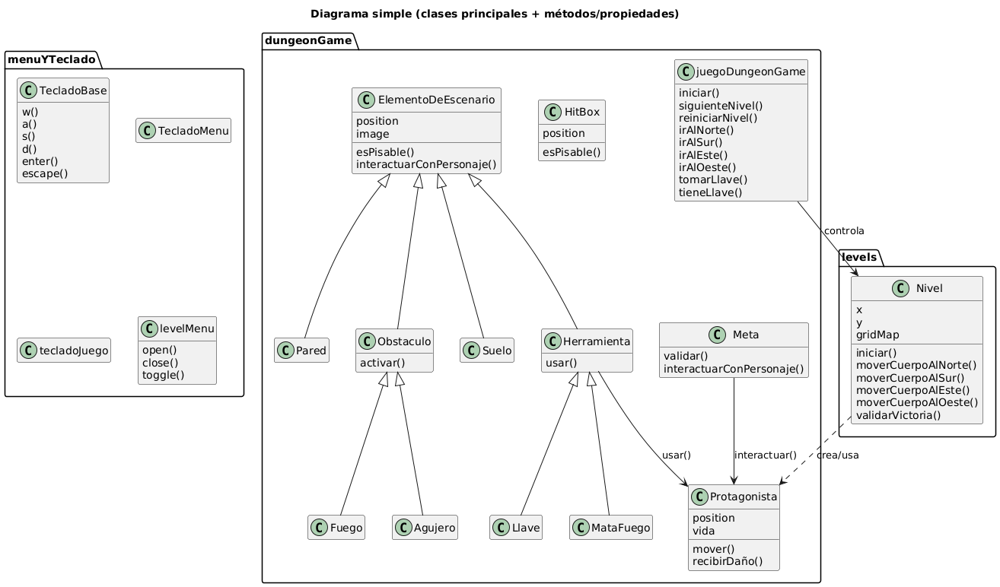

# Conceptos Teóricos aplicados en el TP

## ***Polimorfismo***
>Capacidad de los objetos de diferentes clases de responder de manera distinta a un mismo mensaje. Esto permite que un mismo código interactúe con diferentes tipos de objetos de una manera uniforme y flexible.

En este trabajo práctico, aplicamos en varias ocasiones el concepto de *polimorfismo*:

### ¿Cómo se renderizan nuestros niveles?

Una aplicacion clara de este concepto se observa en los objetos **"decoders"** *(v, p, _, m, z, l, x, o ,k ,f ,u ,n ,s ,e ,w , d)*, que se encargan de generar los elementos dentro de cada nivel según su posición en el `Gridmap`. Cada uno de estos objetos implementa el método `decode()`, pero realiza una tarea diferente al ejecutarlo, permitiendo que cada objeto decodificador interprete su función específica de forma autónoma.

## ***Herencia***

> Mecanismo que permite a una clase adquirir las propiedades y métodos de otra clase, estableciendo una relación jerárquica entre ellas. Esto facilita la reutilización de código, evitando que se repita la lógica, permitiendo crear estructuras de clases más organizadas y extensibles.

### ¿Cómo validamos que un nivel haya sido completado exitosamente?

La *herencia* aquí se observa en la implementación de `MetaValidadora`, que extiende las funcionalidades básicas de `Meta` para encargarse de validar la condición de victoria al colisionar con un elemento del cuerpo y permitir el avance al siguiente nivel. Se optó por hacer que solo una de las metas sea la validadora, evitando así que múltiples instancias ejecuten la misma lógica, lo que optimiza los tiempos de carga de nivel.

# Diagrama de clases 

